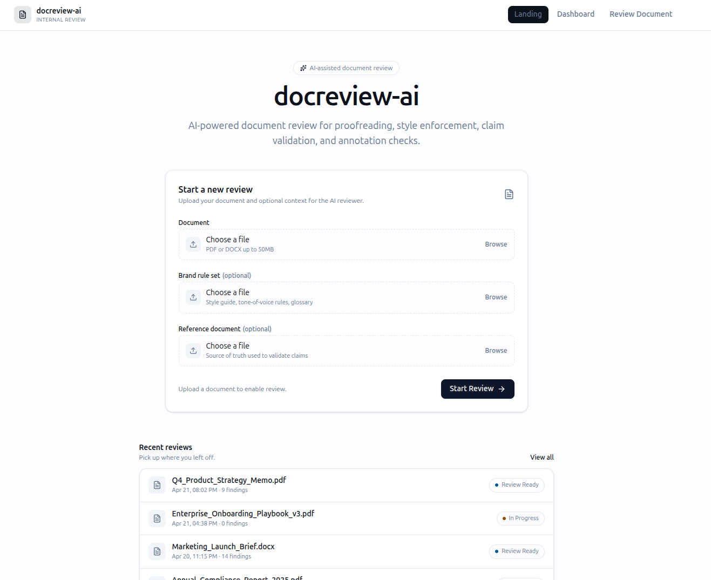
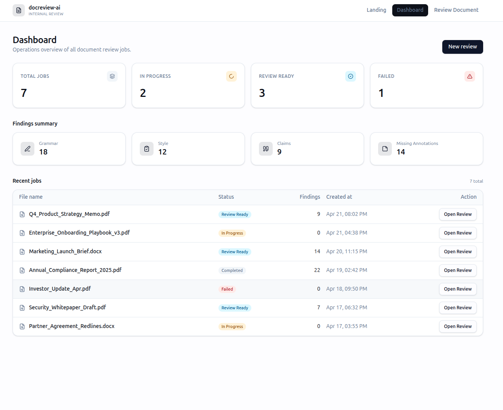
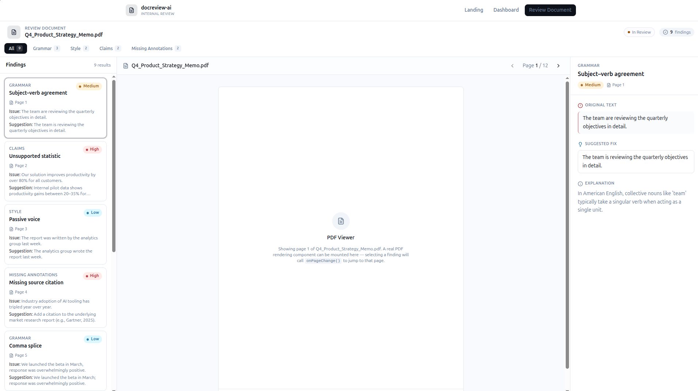

# AI Automation - Document Review Product

## Core capabilities
- Grammar and spelling checks
- Brand/style enforcement
- Verification against reference documents
- Checks for missing annotations, citations, & perform disclaimer checks
- Structured issue severity
- Reviewer comments on PDF, without editing original content
- Human review & approval flow
- Audit trail of who checked what, when, and why

## Core stack
- n8n
- Supabase
- FastAPI
- AWS Bedrock

## Screenshots

<!-- PYTHONPATH=. uvicorn backend.api.main:app --host 0.0.0.0 --port 8000 --reload -->